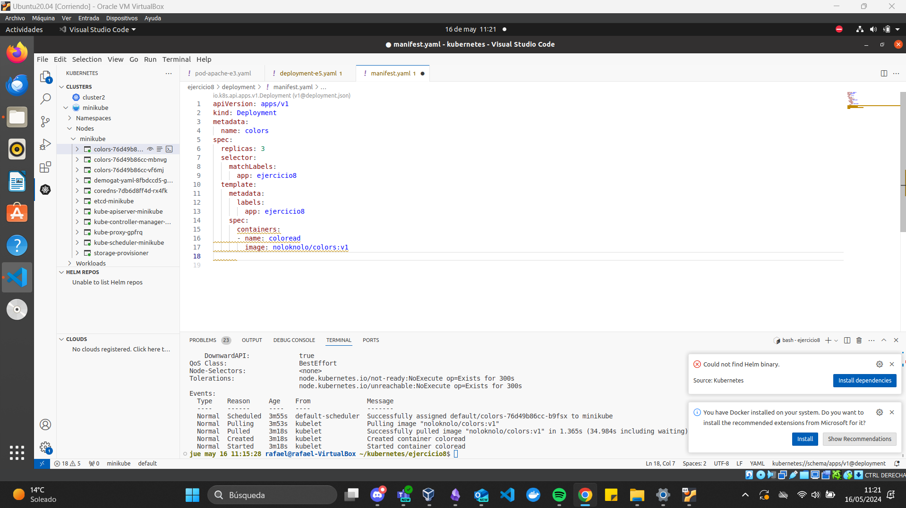
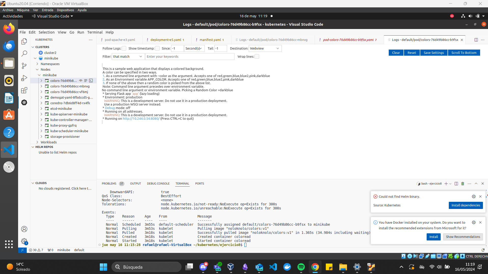
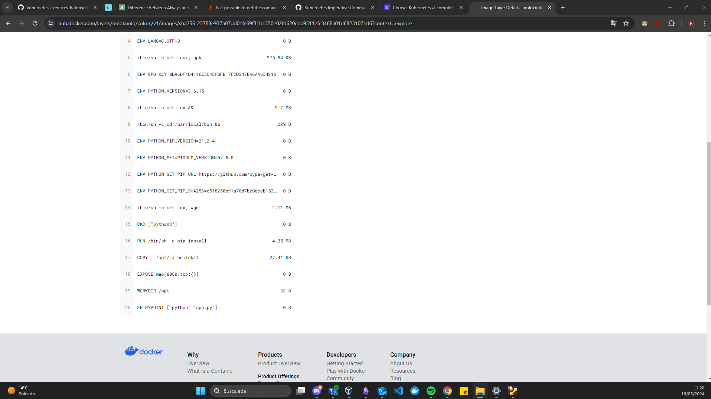
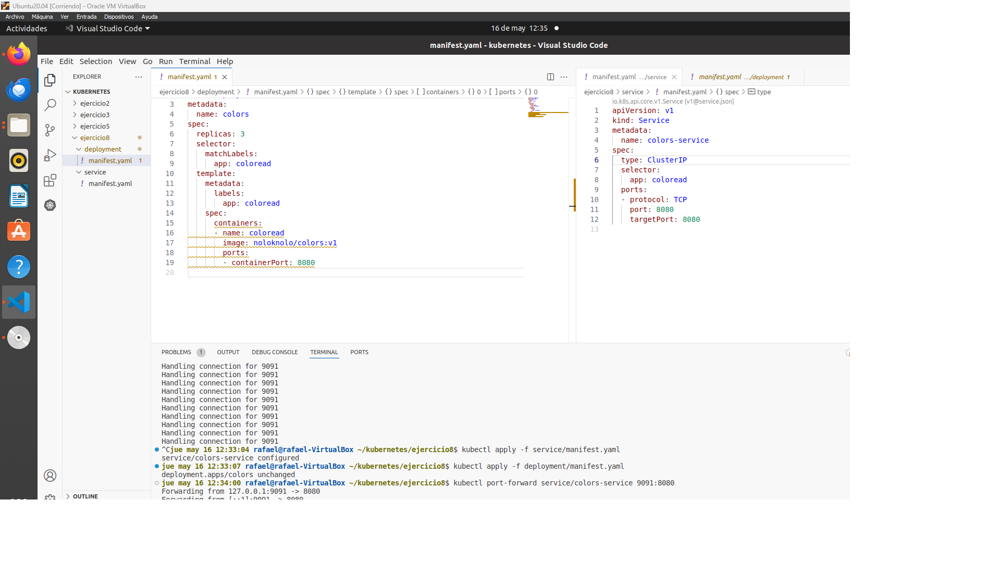
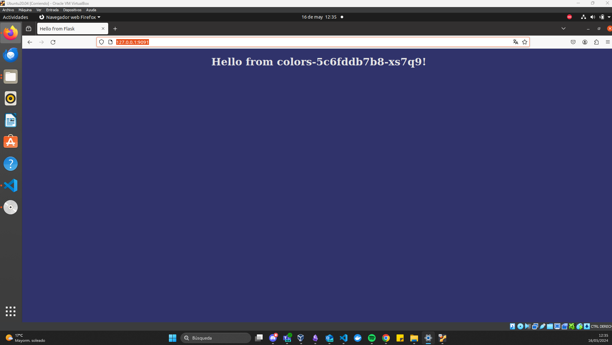
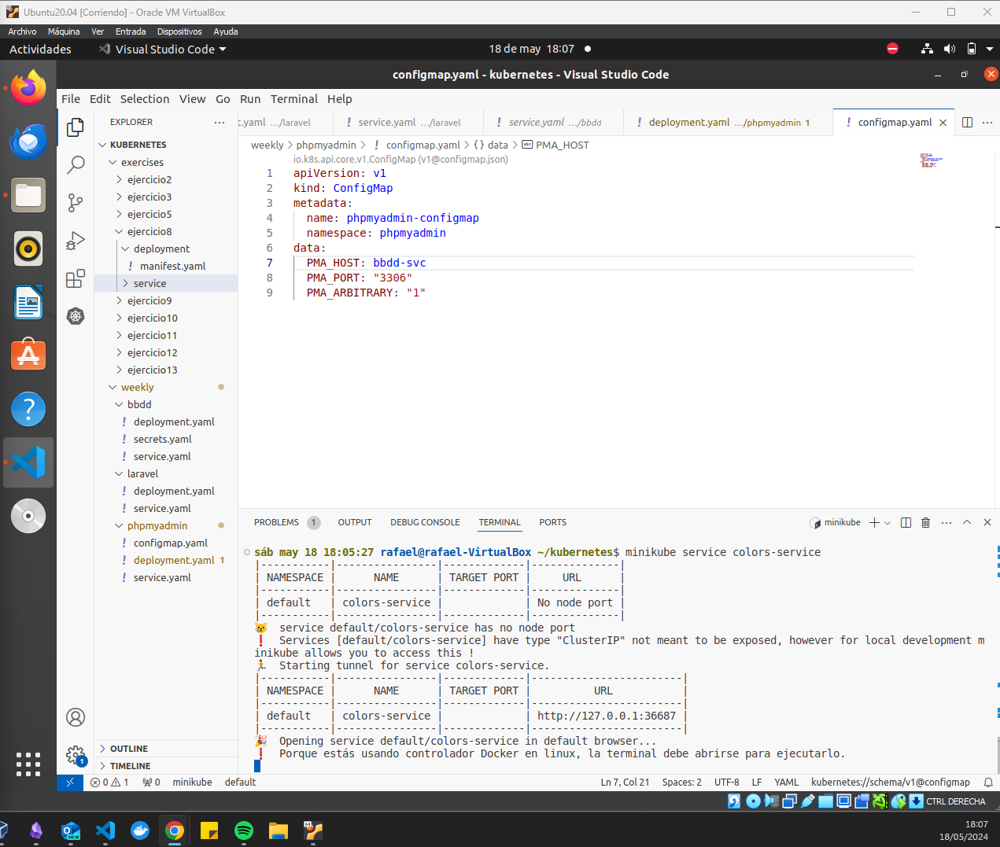
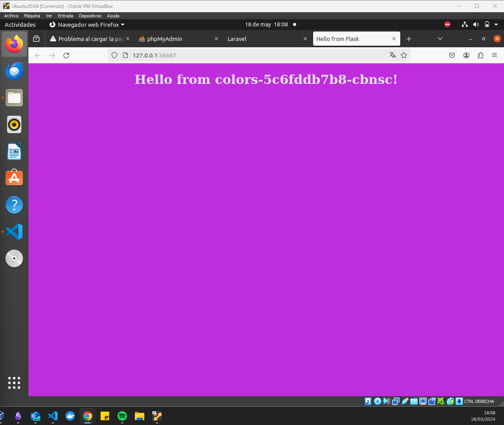
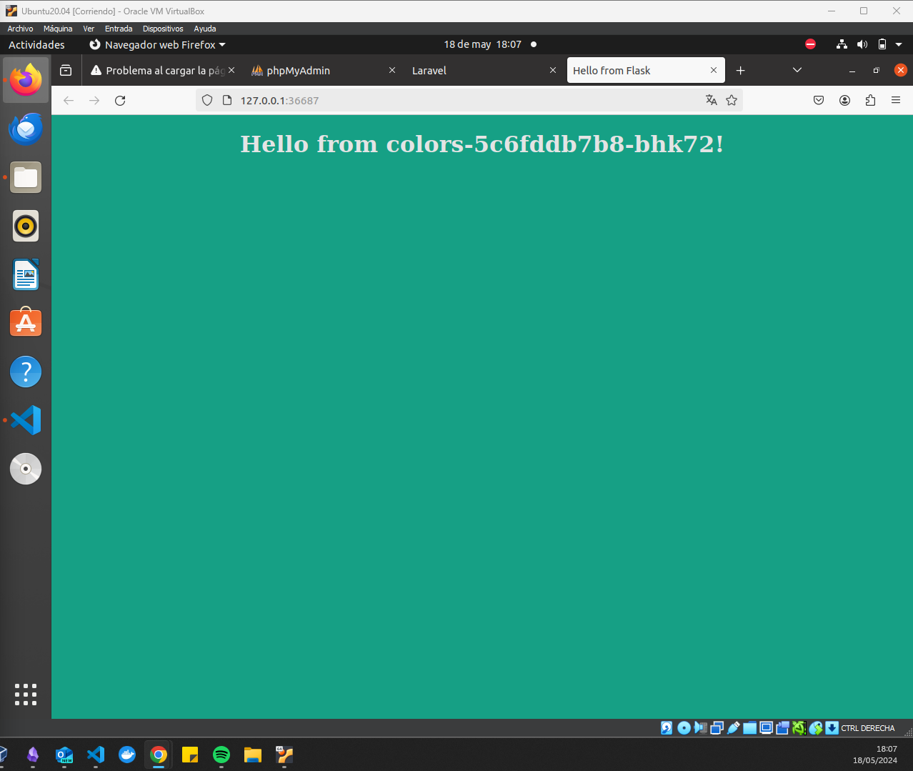

# Ejercicio 8

Deployment: 

Para obtener el puerto he accedido al log del pod y he revisado el Dockerfile de la imagen: 

Se crea el servicio y se hace un port forward

Para poder ver correctamente el balanceo del servicio uso el comando ``minikube service colors-service``, ya que  el portforward al servicio conectará a un pod aleatorio, pero mantendrá la sensión.

